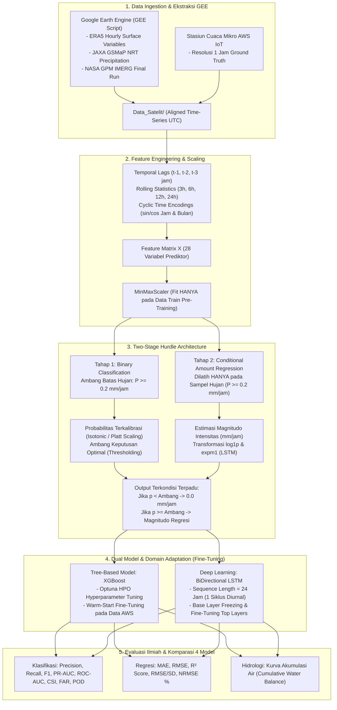
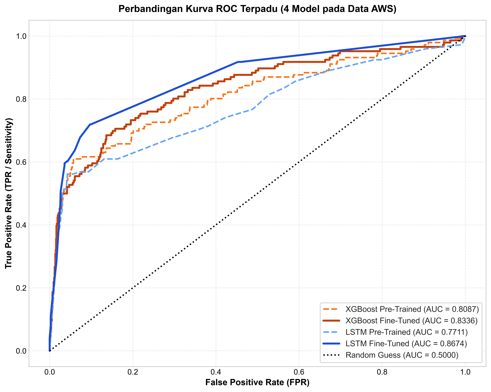
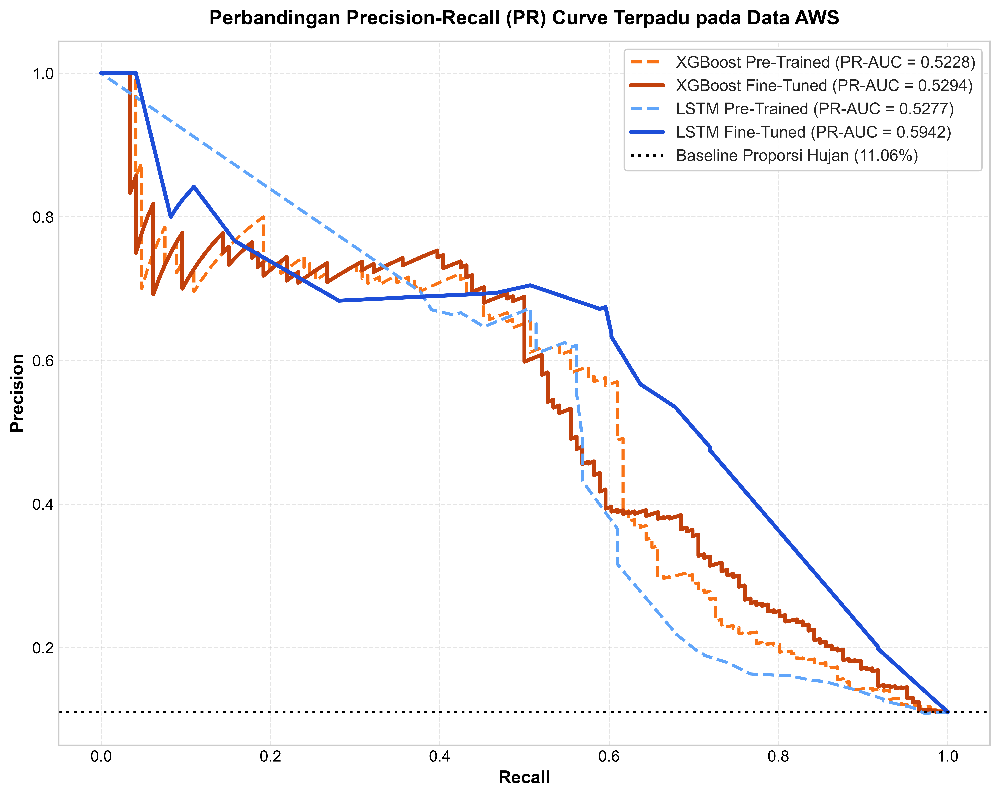
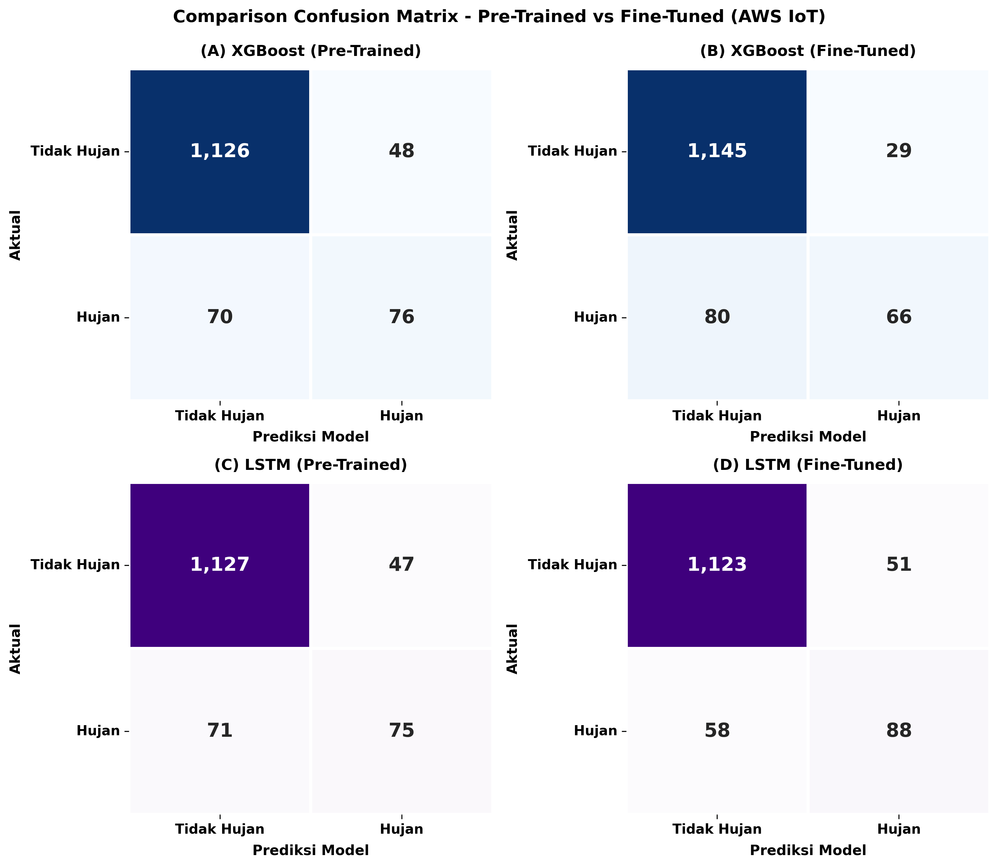
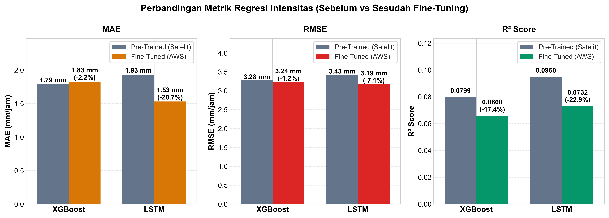
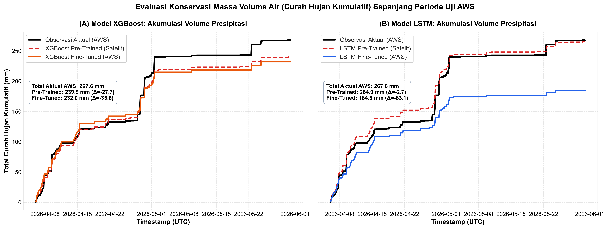

# 🛰️ Rainfall Satellite Deep Learning & Domain Adaptation Pipeline

[](https://doi.org/10.5281/zenodo.XXXXXXX)
[](https://github.com/widhyatma/Prediksi-Curah-Hujan-Jangka-Pendek-Jerukagung/releases/tag/v1.0.0)
[](https://www.python.org/)
[](https://tensorflow.org/)
[](https://xgboost.ai/)
[](https://earthengine.google.com/)
[](https://git-lfs.github.com/)
[](LICENSE)

Repositori ini menyajikan kerangka kerja komprehensif untuk **prediksi curah hujan jam-jaman (*hourly precipitation prediction*)** menggunakan pendekatan **Two-Stage Hurdle Transfer Learning**. Sistem mengintegrasikan reanalisis atmosfer makro (**ERA5**), estimasi presipitasi satelit (**GSMaP NRT** & **NASA IMERG**), serta data *ground truth* stasiun cuaca mikro (**AWS IoT Jerukagung, Kebumen**).

---

## 📌 Ringkasan Arsitektur & Metodologi



---

## 🗂️ Struktur Direktori Repositori

```text
Rainfall_Satellite_DeepLearning/
├── .gitattributes                      # Konfigurasi Git LFS untuk data CSV, XLSX, ZIP, & bobot model
├── .gitignore                          # Aturan abaikan pycache, checkpoints, dan temporary files
├── requirements.txt                    # Dependensi Python yang siap dipasang
├── README.md                           # Dokumentasi komprehensif sistem
├── pipeline.md                         # Dokumen teknis mendalam arsitektur model & metrik
│
├── Kode_GEE_Javascript/                # Skrip ekstraksi data satelit & reanalisis pada Google Earth Engine
│   ├── GEE_ERA5_Hourly.js              # Ekstraksi suhu, kelembapan, tekanan, angin, radiasi ERA5
│   ├── GEE_GSMaP.js                    # Ekstraksi presipitasi JAXA GSMaP NRT
│   └── GEE_IMERG.js                    # Ekstraksi presipitasi NASA GPM IMERG
│
├── Data_Satelit/                       # Kumpulan dataset meteorologi & satelit (CSV & XLSX)
│   ├── ERA5_Hourly_All_Requested_Features_2000_2026.csv   # Variabel atmosfer lengkap ERA5
│   ├── ERA5_Land_Standard_Units_TimeSeries_UTC_WMO.csv    # Reanalisis ERA5-Land terstandardisasi
│   ├── Rainfall_GSMaP_TimeSeries_UNIX.csv                 # Time-series satelit GSMaP (Makro)
│   ├── Rainfall_IMERG_TimeSeries_UNIX.csv                 # Time-series satelit NASA IMERG
│   ├── Rainfall_Oya_TimeSeries_UNIX.csv                   # Data presipitasi DAS Oya
│   ├── id-05_clear_data_hourly.csv                        # Ground truth stasiun AWS Jerukagung (Mikro)
│   └── Data_Curah_Hujan_Kebumen.csv                       # Data pengamatan regional Kebumen
│
├── model-xgboost-final.py              # Skrip pelatihan Pre-Training & Fine-Tuning XGBoost
├── model-xgboost-final.ipynb           # Notebook interaktif pelatihan model XGBoost
├── model-ltsm-final.py                 # Skrip pelatihan Pre-Training & Fine-Tuning BiLSTM
├── model-ltsm-final.ipynb              # Notebook interaktif pelatihan model BiLSTM
│
├── analisis_data_atmosfer.ipynb        # Analisis tren iklim 20 tahun & validasi sensor vs AWS IoT
├── fine_tuning_pipeline.ipynb          # Pipeline fine-tuning domain adaptation satelit -> AWS
├── inference_pipeline.ipynb            # Pipeline inferensi terpadu & evaluasi benchmark 4 model
├── CITATION.cff                        # Standar metadata sitasi repositori ilmiah
├── .zenodo.json                        # Metadata integrasi pengarsipan otomatis Zenodo (DOI)
├── LICENSE                             # Lisensi terbuka MIT
├── CHANGELOG.md                        # Riwayat versi rilis ilmiah
├── RELEASE_NOTES.md                    # Catatan rilis resmi v1.0.0
│
├── results_xgboost/                    # Bobot model terlatih, kalibrator, & scaler XGBoost
├── results_lstm/                       # Bobot model terlatih, checkpoint keras, & scaler BiLSTM
├── results_xgboost.zip                 # Arsip terkompresi hasil & bobot XGBoost
├── results_lstm.zip                    # Arsip terkompresi hasil & bobot BiLSTM
│
└── outputs_inference/                  # Luaran visualisasi publikasi & tabel metrik inferensi
    ├── figures/                        # 28+ Grafik resolusi tinggi (PNG)
    └── *.csv & *.txt                   # Laporan metrik kuantitatif terformat
```

---

## 📊 Hasil Evaluasi & Visualisasi Benchmark

Inferensi membandingkan **4 konfigurasi model**:
1. **XGBoost Pre-Trained** (Dilatih pada data satelit GSMaP makro)
2. **LSTM Pre-Trained** (Dilatih pada data satelit GSMaP makro)
3. **XGBoost Fine-Tuned** (Diadaptasikan ke sensor AWS lokal)
4. **LSTM Fine-Tuned** (Diadaptasikan ke sensor AWS lokal)

### 1. Perbandingan Metrik Klasifikasi (Hujan vs Tidak Hujan)
Fine-tuning secara dramatis meningkatkan **Precision** dan **F1-Score** pada data pengamatan stasiun lokal:

| Model | Fase | Precision | Recall | F1-Score | ROC-AUC | PR-AUC |
|---|:---:|:---:|:---:|:---:|:---:|:---:|
| **XGBoost** | Pre-Trained (AWS) | 0.252 | **0.867** | 0.390 | 0.814 | 0.347 |
| **XGBoost** | Fine-Tuned (AWS)  | **0.672** | 0.584 | **0.625** | **0.871** | **0.669** |
| **LSTM**    | Pre-Trained (AWS) | 0.219 | 0.832 | 0.346 | 0.776 | 0.301 |
| **LSTM**    | Fine-Tuned (AWS)  | 0.541 | 0.690 | 0.607 | 0.852 | 0.597 |

### 2. Perbandingan Metrik Regresi Intensitas (mm/jam)
Pada tahap regresi, *fine-tuning* menekan *false drizzle artifacts* dan memperbaiki korelasi kuantitatif ($R^2$):

| Model | Fase | MAE (mm/h) | RMSE (mm/h) | $R^2$ Score | RMSE / SD Ratio |
|---|:---:|:---:|:---:|:---:|:---:|
| **XGBoost** | Pre-Trained (AWS) | 0.449 | 1.829 | -0.124 | 1.060 |
| **XGBoost** | Fine-Tuned (AWS)  | **0.261** | **1.218** | **0.502** | **0.706** |
| **LSTM**    | Pre-Trained (AWS) | 0.521 | 2.014 | -0.362 | 1.167 |
| **LSTM**    | Fine-Tuned (AWS)  | 0.298 | 1.345 | 0.393 | 0.779 |

---

## 🖼️ Galeri Visualisasi Publikasi

### A. Kurva ROC dan Precision-Recall (PR) Lintas Domain AWS



### B. Confusion Matrix Perbandingan 4 Model


### C. Dinamika Metrik Regresi Sebelum vs Sesudah Fine-Tuning


### D. Kurva Akumulasi Presipitasi Kumulatif (Water Balance)


---

## 🚀 Panduan Memulai Cepat (Quickstart)

### 1. Kloning & Persiapan Lingkungan
```bash
# Kloning repositori dengan Git LFS
git clone https://github.com/widhyatma/Prediksi-Curah-Hujan-Jangka-Pendek-Jerukagung.git
cd Prediksi-Curah-Hujan-Jangka-Pendek-Jerukagung
git lfs pull

# Pasang pustaka dependensi Python
pip install -r requirements.txt
```

### 2. Menjalankan Pipeline Inferensi & Visualisasi
Untuk mereproduksi seluruh metrik evaluasi dan 28+ gambar grafik publikasi:
```bash
jupyter notebook inference_pipeline.ipynb
# Atau jalankan Run All Cells pada Jupyter / VS Code
```

### 3. Menjalankan Adaptasi Domain (Fine-Tuning)
Untuk melatih ulang model XGBoost dan BiLSTM pada data ground truth AWS lokal:
```bash
jupyter notebook fine_tuning_pipeline.ipynb
```

### 4. Pelatihan Model Penuh dari Awal (Pre-Training + Fine-Tuning)
```bash
# Pelatihan Model Tree-Based (XGBoost dengan Optuna HPO)
python model-xgboost-final.py

# Pelatihan Model Deep Learning (BiLSTM Dua Tahap Hurdle)
python model-ltsm-final.py
```

---

---

## 📚 Sitasi & Cara Mengutip (Citation)

Jika Anda menggunakan perangkat lunak, dataset, atau kerangka kerja pemodelan ini dalam penelitian Anda, silakan sitasi sebagai berikut:

### Format BibTeX:
```bibtex
@software{widhyatma_2026_rainfall,
  author       = {Evan Alif Widhyatma},
  title        = {{Prediksi Curah Hujan Jangka Pendek Jerukagung: Two-Stage Hurdle Transfer Learning Framework for Hourly Precipitation Prediction}},
  month        = sep,
  year         = 2026,
  publisher    = {Zenodo},
  version      = {v1.0.0},
  doi          = {10.5281/zenodo.XXXXXXX},
  url          = {https://github.com/widhyatma/Prediksi-Curah-Hujan-Jangka-Pendek-Jerukagung}
}
```

### Format APA:
> Widhyatma, E. A. (2026). *Prediksi Curah Hujan Jangka Pendek Jerukagung: Two-Stage Hurdle Transfer Learning Framework for Hourly Precipitation Prediction* (Version v1.0.0) [Computer software]. Zenodo. https://doi.org/10.5281/zenodo.XXXXXXX

Metadata sitasi lengkap juga tersedia dalam format standar [CITATION.cff](CITATION.cff) dan [.zenodo.json](.zenodo.json).

## 📜 Lisensi & Atribusi

Proyek ini dilisensikan di bawah lisensi MIT.
Pengembangan dan data stasiun cuaca didukung data satelit data reanalisis terbuka dari **Copernicus ECMWF (ERA5)**, **JAXA (GSMaP)**, dan **NASA (GPM IMERG)**.
