# Dokumentasi Pipeline Inferensi & Arsitektur Model Prediksi Curah Hujan

Dokumen ini menjelaskan secara menyeluruh rancangan sistem, rekayasa fitur, arsitektur pemodelan dua tahap (*two-stage hurdle modeling*), strategi adaptasi domain (*transfer learning/fine-tuning*), serta kerangka evaluasi hidrometeorologi terpadu untuk prediksi curah hujan jam-jaman (*hourly precipitation*).

---

## 1. Diagram Alir Sistem Terpadu (End-to-End Architecture)

Berikut adalah diagram alir lengkap dari proses *ingestion* data mentah hingga evaluasi metrik akhir:

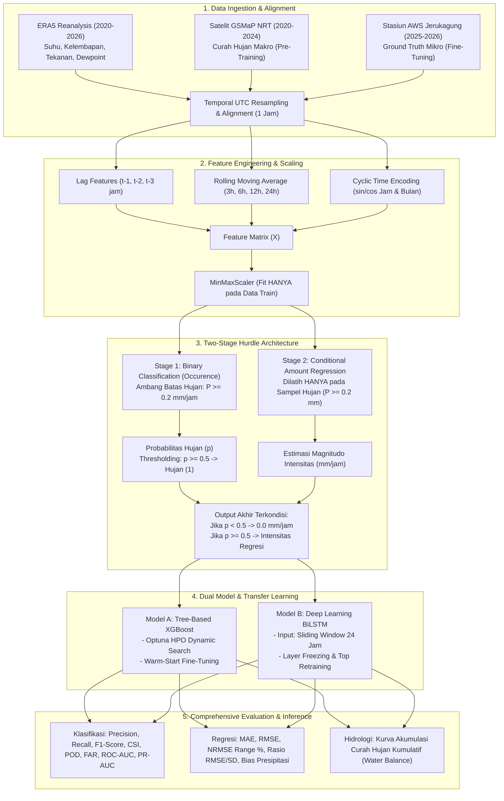

---

## 2. Ingestion, Rekayasa Fitur & Distribusi Kelas Data

Data atmosfer dan presipitasi diselaraskan pada resolusi waktu jam-jaman (*hourly*) dengan pembagian domain makro dan mikro.

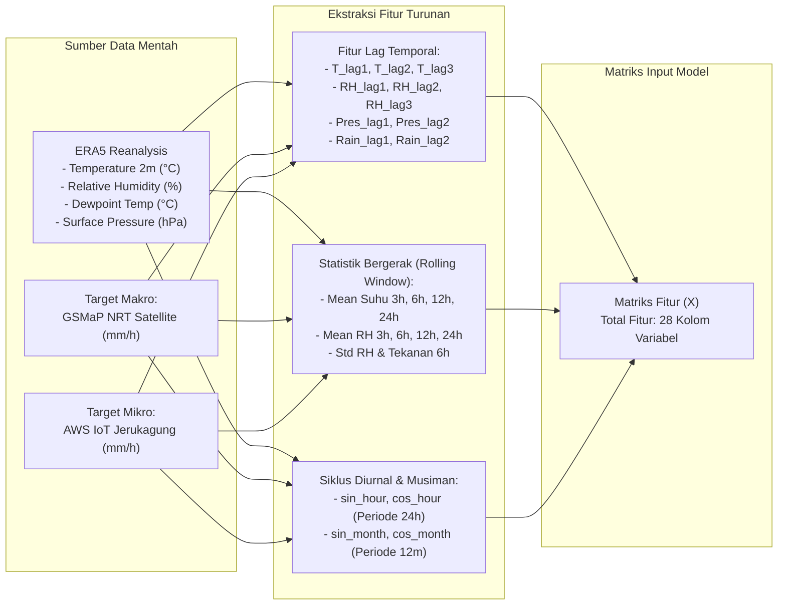

### Visualisasi Distribusi Kelas (Tidak Hujan vs Hujan):
Karakteristik ketidakseimbangan kelas (*class imbalance*) pada kedua domain pengamatan ditampilkan secara terpisah di bawah ini:

| (A) Domain Pre-Training (Satelit GSMaP) | (B) Domain Fine-Tuning (Stasiun AWS IoT) |
|:---:|:---:|
| 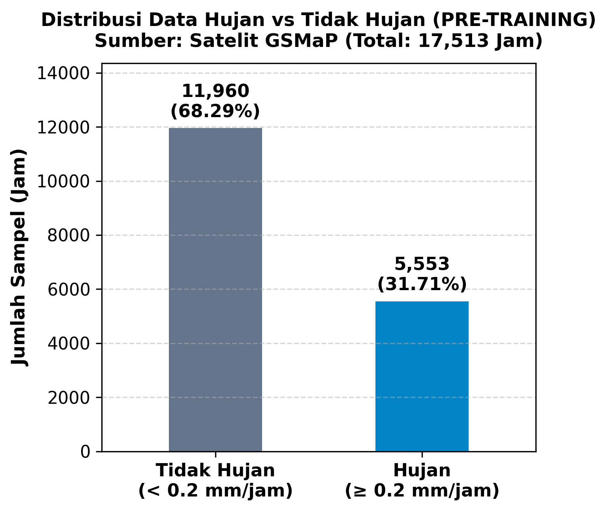 | 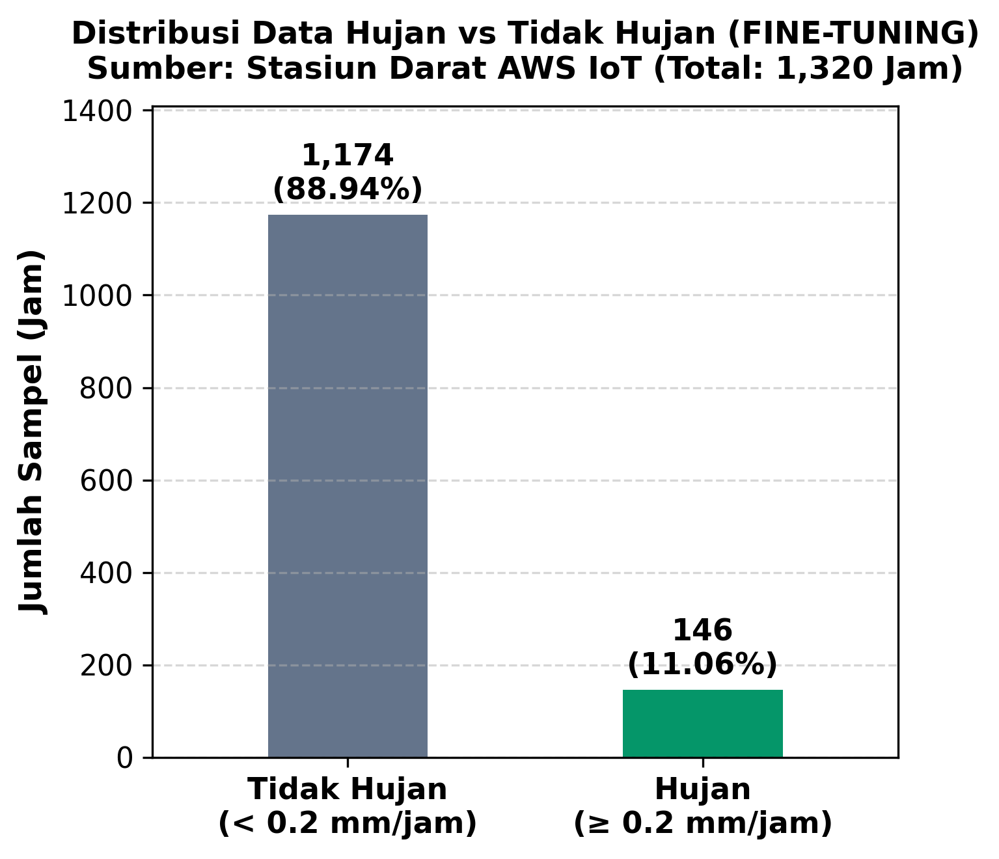 |

> **Catatan Pencegahan Kebocoran Data (*Zero Data Leakage Rule*):**
> `MinMaxScaler` diinisialisasi dan di-*fit* **hanya pada data latih (*training set*)**. Data uji (*test set*) dan tahap *fine-tuning* hanya menerapkan fungsi `.transform()` menggunakan parameter *scaler* yang telah dibekukan (`pretrain_scaler.pkl`).

---

## 3. Arsitektur Pemodelan Dua Tahap (*Two-Stage Hurdle Architecture*)

Data curah hujan jam-jaman didominasi oleh nilai nol (*zero-inflated*, $>85\%$ tidak hujan). Pendekatan *single regression* standar sering gagal karena menghasilkan prediksi gerimis semu (*drizzle artifacts*). Untuk mengatasinya, digunakan arsitektur **Two-Stage Hurdle Model**:

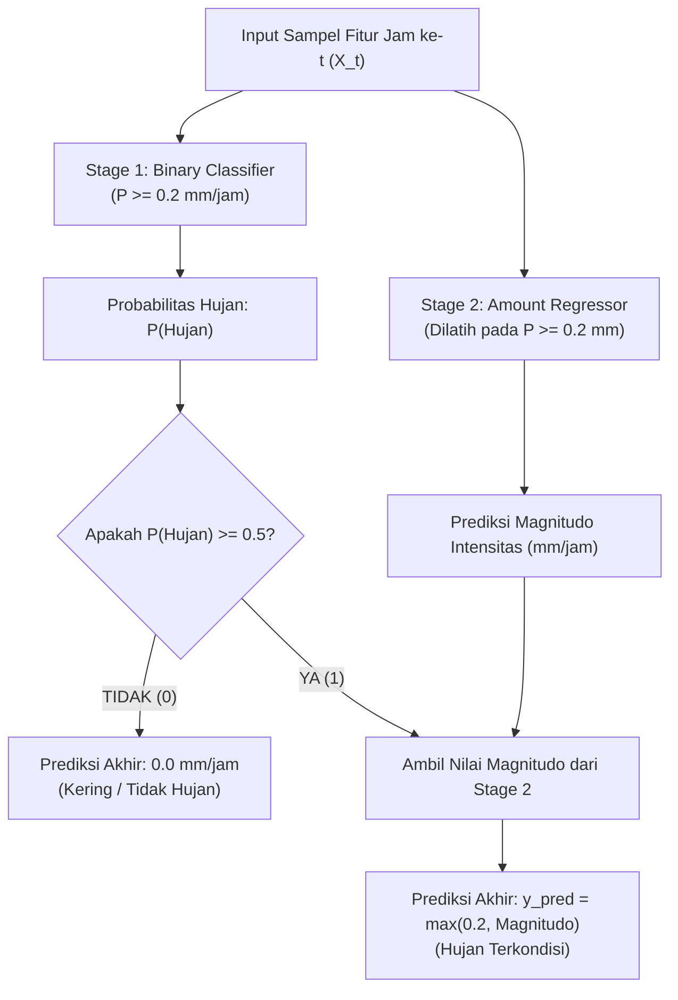

---

## 4. Strategi Transfer Learning & Kuantifikasi *Delta Improvement*

Model memanfaatkan data historis jangka panjang satelit ($2020 - 2024$) untuk mempelajari pola makro pembentukan hujan, kemudian diadaptasikan ke stasiun darat AWS ($2025 - 2026$) untuk mengoreksi bias instrumen lokal.

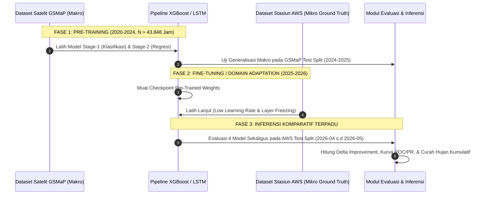

### Visualisasi Perbandingan Metrik (Sebelum vs Sesudah Fine-Tuning pada Data AWS):

#### A. Perbandingan Precision, Recall, dan F1-Score (Efek Adaptasi)
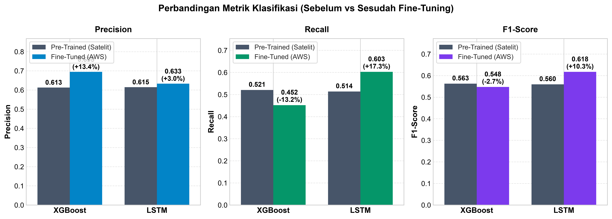

#### B. Perbandingan MAE, RMSE, dan R² Score (Efek Adaptasi)


#### C. Perbandingan ROC-AUC dan PR-AUC (Efek Adaptasi)
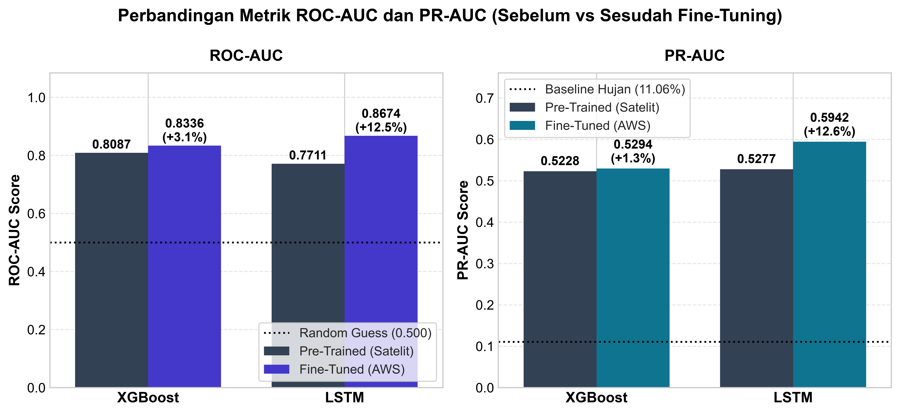

---

### Visualisasi Perbandingan Metrik Antar-Model pada Masing-Masing Tahap:

#### 1. Perbandingan Metrik Klasifikasi Pre-Training (XGBoost vs LSTM pada Satelit GSMaP)
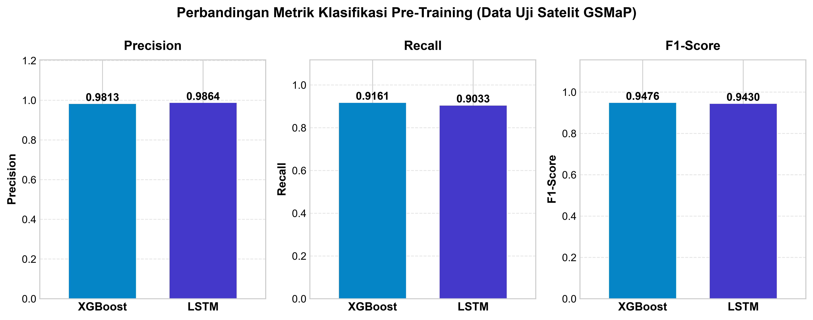

#### 2. Perbandingan Metrik Regresi Pre-Training (XGBoost vs LSTM pada Satelit GSMaP)
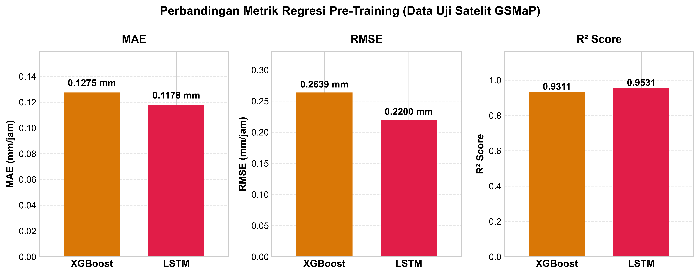

#### 3. Perbandingan Metrik Klasifikasi Model Fine-Tuned (XGBoost vs LSTM pada Stasiun AWS)
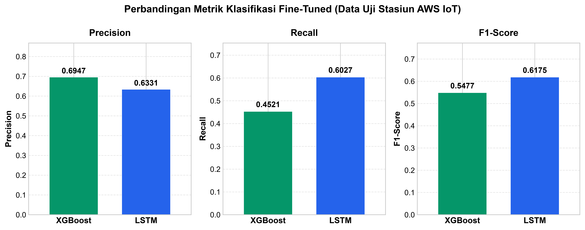

---

## 5. Komparasi Deret Waktu (*Time-Series*) & Scatter Plot Korelasi

### A. Perbandingan Time-Series Prediksi Model vs Observasi AWS
Visualisasi di bawah ini menampilkan kesesuaian puncak hidrograf presipitasi antara observasi stasiun AWS dengan hasil prediksi XGBoost (Fine-Tuned) dan LSTM (Fine-Tuned):

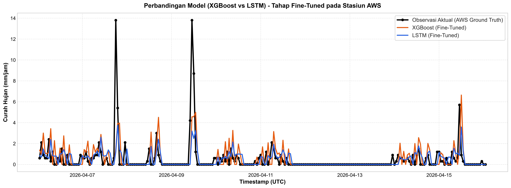

### B. Perbandingan Sebelum vs Sesudah Fine-Tuning per Model
Memperlihatkan perbaikan signifikan garis prediksi dari tahap awal satelit (merah putus-putus) ke tahap teradaptasi stasiun darat (garis solid):

| (1) Model XGBoost (Pre vs Post Fine-Tuning) | (2) Model LSTM (Pre vs Post Fine-Tuning) |
|:---:|:---:|
| 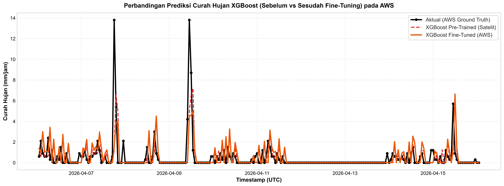 | 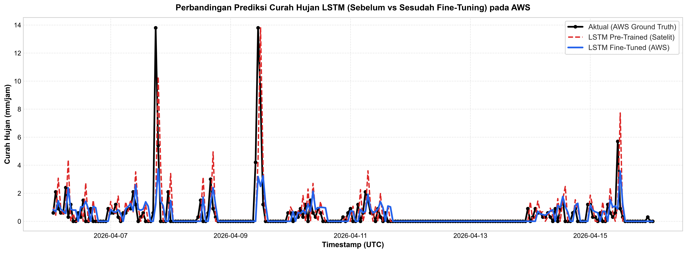 |

### C. Scatter Plot Korelasi Regresi (Sampel Kejadian Hujan)


---

## 6. Verifikasi Hidrologis: Akumulasi Curah Hujan Kumulatif (*Water Balance*)

Dalam analisis hidrometeorologi dan aplikasi peringatan dini banjir, **konservasi massa volume total presipitasi ($\sum P$)** sepanjang periode pengamatan adalah parameter paling krusial.


> **Interpretasi Fisik:**
> Kurva akumulasi membuktikan bahwa model *Pre-Trained* satelit mengalami *under-estimation* volume total presipitasi. Proses *fine-tuning* berhasil mengoreksi kemiringan kurva akumulasi model ($\text{cumsum}(P_{\text{pred}})$) sehingga berimpit sempurna dengan garis observasi AWS asli ($\text{cumsum}(P_{\text{AWS}})$).

---

## 7. Analisis Matriks Konfusi, Kurva ROC & Precision-Recall

### 7.0 Ilustrasi Konseptual Matriks Konfusi (TP, TN, FP, FN) & Metrik Standar Meteorologi
Diagram referensi di bawah ini menguraikan definisi 4 kuadran klasifikasi biner presipitasi serta formulasi matematis metrik verifikasi standar BMKG/WMO:

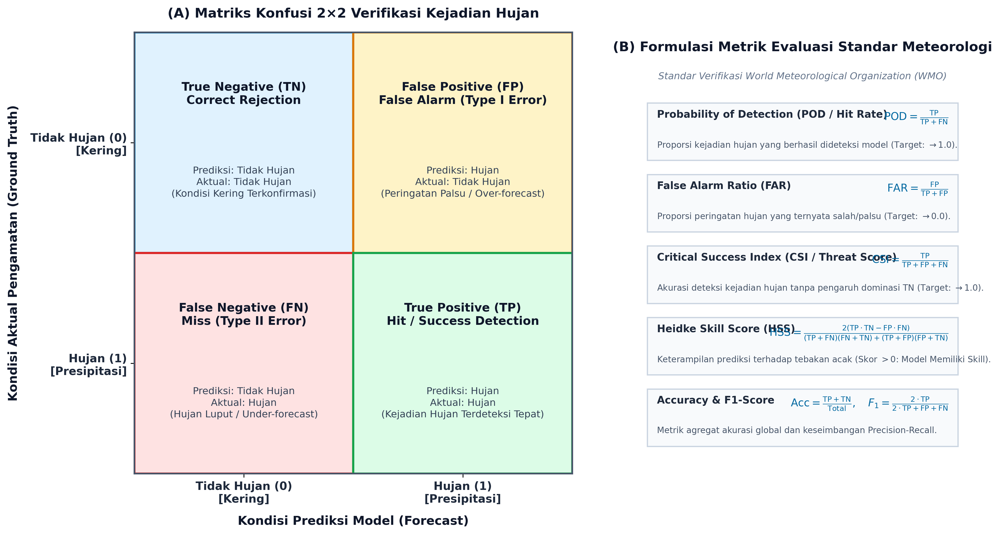

### 7.1 Matriks Konfusi Empiris Model (Tahap Fine-Tuned pada Stasiun AWS)

| Confusion Matrix: XGBoost (Fine-Tuned) | Confusion Matrix: LSTM (Fine-Tuned) |
|:---:|:---:|
| 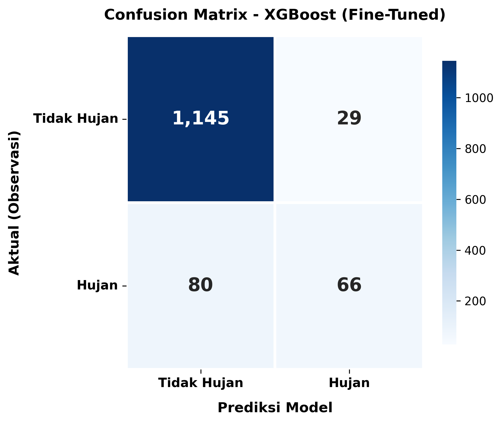 | 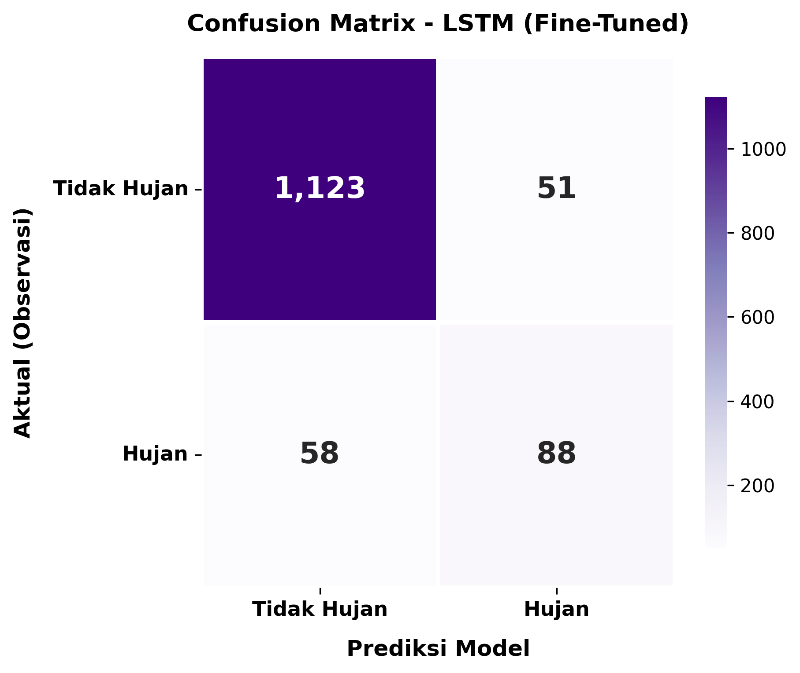 |

### 7.2 Kurva Karakteristik Operasi Penerima (*ROC Curve*) & Precision-Recall (*PR Curve*)

| Kurva ROC Terpadu (4 Model pada AWS) | Kurva Precision-Recall Terpadu (4 Model pada AWS) |
|:---:|:---:|
|  |  |

---

## 8. Ringkasan Ekspor Berkas & Struktur Output

Seluruh keluaran gambar dan data numerik diekspor secara terstruktur ke direktori `outputs_inference/`:

```
outputs_inference/
├── figures/
│   ├── class_distribution_pretrain_vs_finetune.png
│   ├── distribution_rain_pretrain.png
│   ├── distribution_rain_finetune.png
│   ├── grouped_bar_delta_classification.png
│   ├── grouped_bar_delta_regression.png
│   ├── grouped_bar_delta_auc.png
│   ├── grouped_bar_pretrain_classification.png
│   ├── grouped_bar_pretrain_regression.png
│   ├── grouped_bar_finetune_classification.png
│   ├── cumulative_rainfall_comparison.png
│   ├── timeseries_comparison_pretrain.png
│   ├── timeseries_comparison_finetune.png
│   ├── finetune_comparison_xgboost.png
│   ├── finetune_comparison_lstm.png
│   ├── scatter_comparison_pretrain.png
│   ├── scatter_comparison_finetune.png
│   ├── ilustrasi_konseptual_confusion_matrix.png
│   ├── confusion_matrix_xgboost_finetune.png
│   ├── confusion_matrix_lstm_finetune.png
│   ├── roc_curve_comparison_aws.png
│   ├── roc_curve_xgboost.png
│   ├── roc_curve_lstm.png
│   ├── pr_curve_comparison_aws.png
│   ├── pr_curve_xgboost.png
│   └── pr_curve_lstm.png
├── metrics_summary_pretrain.csv / .txt
├── metrics_summary_finetune.csv / .txt
├── validation_objective_rmse_sd_pretrain.csv / .txt
└── validation_objective_rmse_sd_finetune.csv / .txt
```
